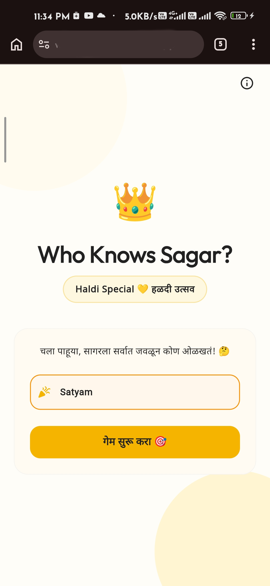
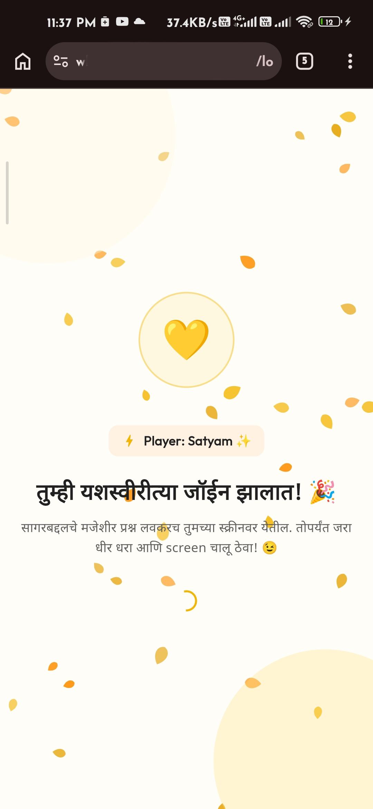
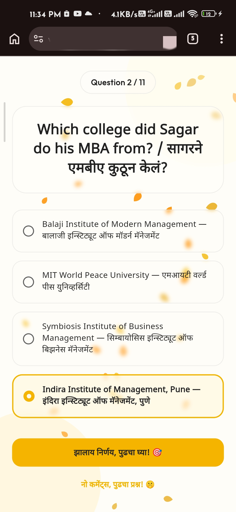
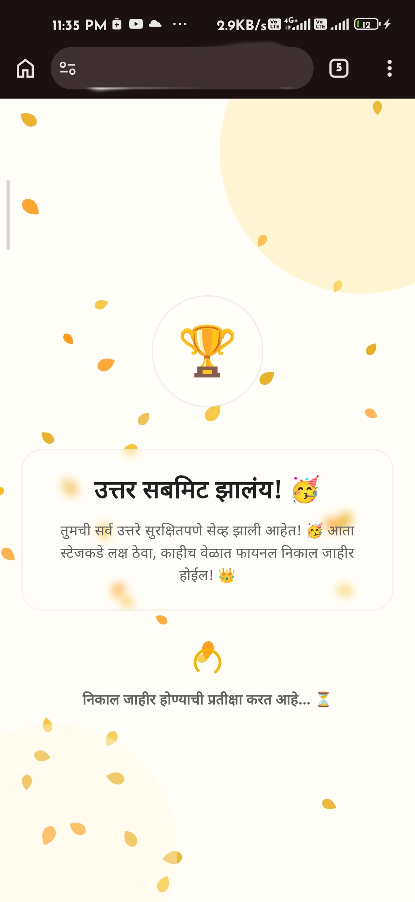
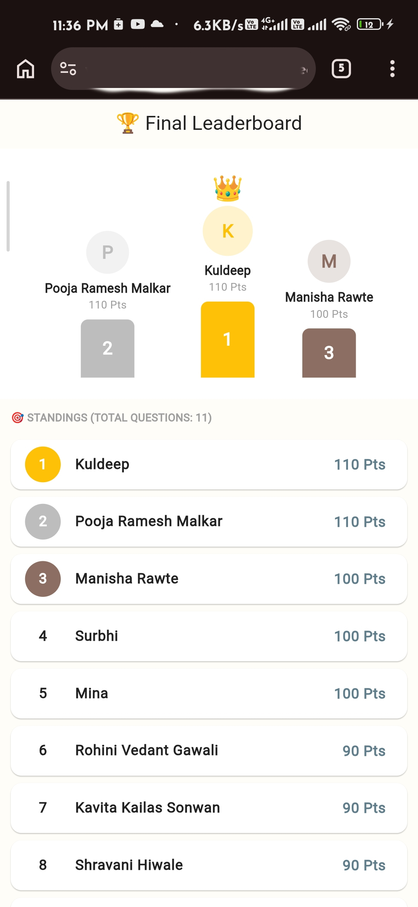

# 👑 Who Knows Sagar?

**Who Knows Sagar?** is a real-time interactive quiz web application built for my cousin's Haldi wedding celebration. Instead of playing a traditional offline game, guests scanned a QR code to join a live trivia game about the groom directly from their mobile web browsers, with no installation required.

The application was successfully used during the live event by approximately **75–80 guests**, demonstrating a practical and engaging real-world use case of Flutter Web.

---

## 📱 App Screenshots

<p align="center">
  
  
  
  
  
</p>

<p align="center">
  <em>Screens (L to R): Welcome screen, waiting lobby, bilingual question, result waiting, and final leaderboard.</em>
</p>

---

## ✨ Key Features

- **Instant QR-Based Access:** Guests join the quiz immediately on their mobile browsers without installing any app.
- **Name-Based Join Flow:** Simple registration that registers players and caches their session to prevent loss of progress on page reload.
- **Bilingual & Marathi-First UI:** Renders Marathi characters beautifully with fallback to English using dynamic Google Fonts loading.
- **Real-Time Synchronization:** Game states, question progression, and scoring are updated instantly on everyone's screens.
- **Event-Themed Haldi UI:** Custom marigold petal shower animation (`CustomPainter`) matching the warm yellow-orange aesthetic of the event.
- **Admin Control Panel:** Allows the host to start the game, control quiz progression, and publish results.
- **Interactive Leaderboard:** Computes guest scores instantly and displays a live podium (1st, 2nd, and 3rd place) alongside overall rankings.

---

## 🛠️ Tech Stack

- **Flutter Web & Dart:** Builds a responsive mobile-web frontend with fluid layouts.
- **Firebase Realtime Database:** Powers instant state synchronization between player devices and the host.
- **Firebase Hosting:** Delivers the web application quickly and securely.
- **Material 3:** Provides clean, modern components and cohesive color styling.

---

## 🔁 How It Works

1. **Access:** Guests scan a QR code at the event to open the hosted web application.
2. **Join:** Players enter their names to register and enter the waiting lobby.
3. **Control:** The host starts the quiz from the admin console, pushing multiple-choice questions to players.
4. **Reveal:** After everyone submits their answers, the host publishes the results, showing the final standings and podium on everyone's device.

---

## 📂 Project Structure

```
lib/
├── core/                 # Shared configurations (Firebase, Router, Theme)
├── providers/            # State management for player, admin, and leaderboard
├── screens/              # UI screens (Welcome, Lobby, Quiz, Waiting, Leaderboard, Admin)
├── widgets/              # Reusable UI components (Custom falling petal animation, text, option tiles)
├── firebase_options.dart # Firebase configuration
└── main.dart             # Application entry point
```

---

## 🎉 Real-World Usage

This project was built and used for a real family Haldi celebration. Approximately **75–80 guests** participated using their mobile browsers. Firebase handled the real-time event data smoothly, creating an interactive highlight during the wedding ceremony.

---

## 🚀 Getting Started

### Prerequisites
- [Flutter SDK](https://docs.flutter.dev/get-started/install) installed on your system.

### 1. Clone the Project
```bash
git clone https://github.com/Satyam-Gawali/who-knows-sagar.git
cd who-knows-sagar
```

### 2. Install Dependencies
```bash
flutter pub get
```

### 3. Configure Firebase
Run the following command to link the project to your Firebase project:
```bash
flutterfire configure
```
*(Select Web support to update `lib/firebase_options.dart`.)*

### 4. Run & Build
- **Run locally on Chrome:**
  ```bash
  flutter run -d chrome
  ```
- **Build for release:**
  ```bash
  flutter build web --release
  ```

---

## ✍️ Author

**Satyam Gawali**  
*Flutter Developer*

[](https://www.linkedin.com/in/satyam-gawali-b4623b268/)

---

*If you found this project interesting, consider giving the repository a star! ⭐*